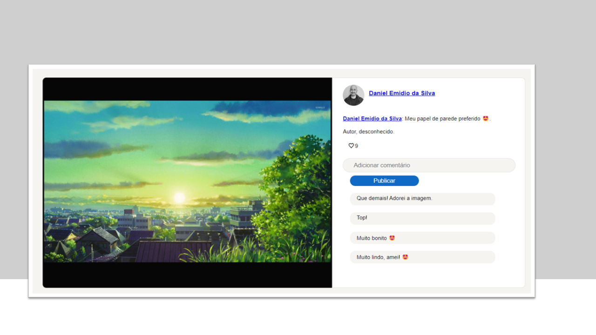

# Template Página de Comentários

## Sobre o projeto
Projeto de estudo elaborado de uma página de comentários de uma foto utilizando Javascript + CSS + HTML. O usuário deve ser capaz de digitar seu comentário e publicar na página.

## Tecnologias

- HTML
- CSS
- Javascript
- Git e Github

## Contato

emidio.daniel@hotmail.com

